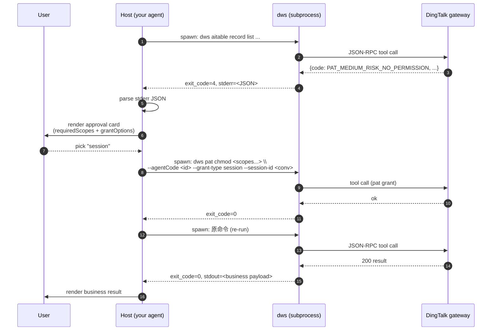
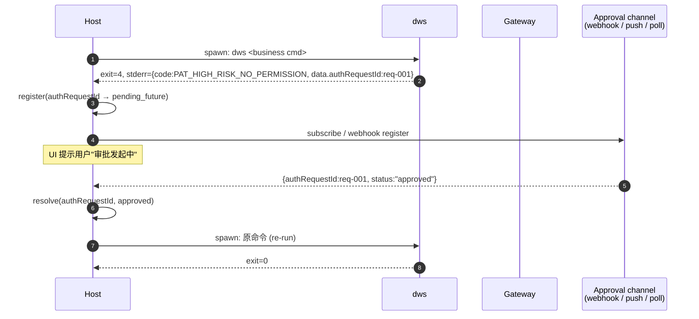

# Host Integration Guide / 宿主集成指南

> 面向第三方 Agent / 桌面宿主 / 自研平台：如何把 `dws` 作为子进程调用，并在 PAT 授权失败时接管 UI 与重试。
> 本文档是**操作手册**；权威常量和 JSON schema 以 [contract.md](./contract.md) 为准。

---

## 1. 集成前检查清单 / Preflight

在开始集成前，请确认下列事项：

- [ ] 已阅读 [contract.md](./contract.md) 的 §1 Exit Code、§2 Stderr JSON Schema、§7 Host-owned 触发条件、§8 `DINGTALK_AGENT` 与 `claw-type`
- [ ] 已决定你的业务 Agent Code（将通过 `DINGTALK_DWS_AGENTCODE` 注入；**这是 host-owned PAT 的唯一触发信号**）
- [ ] 已决定（可选）是否设置业务 Agent 标签 `DINGTALK_AGENT`（非空时转发为 `x-dingtalk-agent` 请求头；与 `claw-type` / host-owned 决策完全解耦）
- [ ] 决定了 Agent Code 的生成方式（例：`md5(open_id + corp_id + device_id)` 或直接用业务注册的 agent code）
- [ ] 宿主有一个可以弹授权 UI 的前端层 / 或等价的可异步确认通道
- [ ] 对**高敏授权**准备好异步回执通道（Webhook / 同步推送 / 轮询 API 等）
- [ ] 已知晓 CLI **不读**身份类 env / header；身份由 `dws auth login` 写入本地凭证

<!-- evidence: w1-lane2 §5 + contract.md §7-§9 -->

---

## 2. 集成步骤（7 步）/ Integration steps

### Step 1 —  安装并定位 CLI 二进制

宿主应允许 CLI 路径被用户覆盖。默认候选顺序：

1. `$PATH` 里的 `dws` / `dws.exe`
2. 宿主可执行目录旁的 `bin/dws`
3. 宿主资源目录下的 `resources/dws/bin/dws`

```bash
# 最小验证
dws version
```

### Step 2 — 登录 / Bootstrap auth

宿主首次启动时应触发一次登录：

```bash
dws auth login                 # 交互式 device flow
# 或：
dws auth exchange --code <code> --uid <openId>   # 宿主已从自有登录链路拿到短期 auth code
```

Exit code 语义：

- `0` — 登录成功，token 已持久化到 `$DWS_CONFIG_DIR`（或默认配置目录）
- `2` — 登录失败（码过期 / 被拒 / 用户取消），宿主应提示用户重试
- `5` — 未预期失败

凭证有效期由 CLI 与服务端共同管理；宿主**不读 token 文件**，仅通过 `dws auth status --json`（如已实现）或 mtime 判新鲜度。<!-- evidence: w1-lane2 §2 + §7.3 -->

### Step 3 — 注入 host-owned 开关与路由标签

在 spawn `dws` 子进程前设置 env：

- **`DINGTALK_DWS_AGENTCODE`**（必填，host-owned PAT 的**唯一**触发信号）：进程内有值时，CLI 命中 PAT 即 `exit=4` + 单行 stderr JSON，不会拉浏览器、不会轮询、不会重试。<!-- evidence: contract.md §7 + internal/auth/channel.go HostOwnsPATFlow -->
- **`DINGTALK_AGENT`**（可选，业务 Agent 标签）：非空时 CLI 将其原样转发为 HTTP 请求头 `x-dingtalk-agent`，用于告诉上游"我是哪个业务 Agent"。它**不**派生 `claw-type`（后者由开源 edition 硬编码为 `openClaw`），**不**影响 host-owned 决策，也**不**决定是否触发授权卡。
- **`DWS_SESSION_ID` / `DWS_TRACE_ID` / `DWS_MESSAGE_ID`**：trace 关联。

```go
// Go 示例 —— 推荐使用 DWS_* 主路径
cmd := exec.CommandContext(ctx, dwsBin, "aitable", "record", "list", "--sheet-id", sheetID)
cmd.Env = append(os.Environ(),
    "DINGTALK_DWS_AGENTCODE=agt-my-copilot-001", // host-owned 唯一触发
    "DINGTALK_AGENT=my-copilot",                  // 业务 Agent 标签（可选；→ x-dingtalk-agent）
    "DWS_SESSION_ID="+conversationID,
    "DWS_MESSAGE_ID="+messageID,
    "DWS_TRACE_ID="+requestID,
)
```

```python
# Python 示例 —— 推荐使用 DWS_* 主路径
env = {
    **os.environ,
    "DINGTALK_DWS_AGENTCODE": "agt-my-copilot-001",  # host-owned 唯一触发
    "DINGTALK_AGENT": "my-copilot",                   # 业务 Agent 标签（可选；→ x-dingtalk-agent）
    "DWS_SESSION_ID": conversation_id,
    "DWS_MESSAGE_ID": message_id,
    "DWS_TRACE_ID": request_id,
}
proc = subprocess.run(
    [dws_bin, "aitable", "record", "list", "--sheet-id", sheet_id],
    env=env, capture_output=True, text=True,
)
```

> **不要**把 token / OAuth access token 放进 env；CLI 不读。 <!-- evidence: w1-lane2 §5.1 -->

#### Backwards compatibility — two independent chains

CLI 接受的兼容别名按 **Chain A / Chain B 分离**；**单条链路的别名不会跨链生效**。详见 [contract.md §9](./contract.md#9-环境变量契约--environment-variable-contract)。

| Purpose | Chain | Primary (recommended) | Compatibility alias | Does NOT consult |
|---|---|---|---|---|
| `dws pat chmod / pat apply --session-id` fallback | **A** (PAT subcommand) | `DWS_SESSION_ID` | `REWIND_SESSION_ID` | `DINGTALK_SESSION_ID` |
| `dws pat chmod / pat apply / pat scopes --agentCode` fallback | **A** (PAT subcommand) | `DINGTALK_DWS_AGENTCODE` | **(none)** | `DWS_AGENTCODE`, `DINGTALK_AGENTCODE`, `REWIND_AGENTCODE` |
| `dws pat status` positional `<authRequestId>` fallback | **A** (PAT subcommand) | `DWS_PAT_AUTH_REQUEST_ID` | **(none)** | `DINGTALK_PAT_AUTH_REQUEST_ID`, `REWIND_PAT_AUTH_REQUEST_ID` |
| Outgoing `x-dingtalk-trace-id` HTTP header | **B** (trace header) | `DWS_TRACE_ID` | `DINGTALK_TRACE_ID` | `REWIND_REQUEST_ID` (only consumed by edition hooks, not Chain B) |
| Outgoing `x-dingtalk-session-id` HTTP header | **B** (trace header) | `DWS_SESSION_ID` | `DINGTALK_SESSION_ID` | `REWIND_SESSION_ID` |
| Outgoing `x-dingtalk-message-id` HTTP header | **B** (trace header) | `DWS_MESSAGE_ID` | `DINGTALK_MESSAGE_ID` | `REWIND_MESSAGE_ID` (only consumed by edition hooks, not Chain B) |

**Key implication for hosts**: setting only `DINGTALK_SESSION_ID` will satisfy the trace-header injection (Chain B) but **will NOT** satisfy a `dws pat chmod --grant-type session` invocation (Chain A). If your host relied on that conflation, migrate to `DWS_SESSION_ID`, which feeds both chains.

已有参考宿主实现可继续沿用既有 `REWIND_*` 注入，无须同步改造；新集成应直接使用 `DWS_*`，可用一次设置同时覆盖两条链路。

### Step 4 — 执行业务命令并捕获退出

```go
out, err := cmd.Output()
exitCode := 0
var stderr []byte
if ee, ok := err.(*exec.ExitError); ok {
    exitCode = ee.ExitCode()
    stderr   = ee.Stderr
}
```

### Step 5 — 分支判断

```go
switch exitCode {
case 0:
    // 成功：stdout 是业务响应
    handleSuccess(out)
case 2:
    // 身份层失败：重新登录
    triggerReLogin()
case 4:
    // PAT 权限不足：进入 Step 6
    handlePAT(stderr)
case 5:
    // 未预期内部错误
    logUnexpected(stderr)
default:
    // 未定义，按通用失败处理
}
```

### Step 6 — 解析 PAT JSON 并走授权流

见 §3、§4。

### Step 7 — 授权完成后重跑原命令

用**完全相同**的参数与 env 重新 `spawn`。不要在重试时重构命令行；不要假设 CLI 会"续传"先前的上下文。

---

## 3. 中敏授权分支 / Medium-risk flow

### 3.1 流程



<!-- evidence: w1-lane2 §2 sequence + §3.1 -->

### 3.2 伪代码 / Pseudo-code

```python
def run_with_pat_recovery(argv, env, agent_code, session_id, max_recursion=3):
    if max_recursion <= 0:
        raise RuntimeError("PAT recovery exceeded retry budget")

    proc = subprocess.run(argv, env=env, capture_output=True, text=True)
    if proc.returncode == 0:
        return proc.stdout

    if proc.returncode != 4:
        raise CommandError(proc.returncode, proc.stderr)

    pat = parse_pat_stderr(proc.stderr)      # tolerant JSON extract

    code = pat.get("code") or pat.get("error_code")
    if code == "PAT_HIGH_RISK_NO_PERMISSION":
        return handle_high_risk(pat, argv, env, agent_code, session_id, max_recursion)
    if code == "PAT_SCOPE_AUTH_REQUIRED":
        return handle_scope_auth(pat, argv, env, agent_code, session_id, max_recursion)

    chosen_option = render_ui_and_get_choice(pat)    # "once" | "session" | "permanent"
    chmod_argv = [
        "dws", "pat", "chmod",
        *pat["data"]["requiredScopes"],
        "--agentCode", agent_code,
        "--grant-type", chosen_option,
    ]
    if chosen_option == "session":
        chmod_argv += ["--session-id", session_id]
    chmod = subprocess.run(chmod_argv, env=env, capture_output=True, text=True)
    if chmod.returncode != 0:
        raise CommandError(chmod.returncode, chmod.stderr)

    return run_with_pat_recovery(argv, env, agent_code, session_id, max_recursion - 1)
```

### 3.3 容错解析 / Tolerant JSON extract

由于宿主 sandbox / 日志过滤层可能在 stderr 的首尾追加非 JSON 行，使用**按首个 `{` 开始尝试反序列化**的宽容策略：

```python
import json

def parse_pat_stderr(stderr: str) -> dict:
    for i, ch in enumerate(stderr):
        if ch != "{":
            continue
        decoder = json.JSONDecoder()
        try:
            obj, _ = decoder.raw_decode(stderr[i:])
            if isinstance(obj, dict) and ("code" in obj or "error_code" in obj):
                return obj
        except json.JSONDecodeError:
            continue
    raise ValueError("no PAT JSON found in stderr")
```

<!-- evidence: w1-lane2 §3.2 -->

---

## 4. 高敏授权分支 / High-risk flow

高敏 (`PAT_HIGH_RISK_NO_PERMISSION`) 在中敏基础上叠加**异步审批回执**：CLI 不能立即续签，宿主必须等待服务端 / 审批人通过**你自选的通道**回执，然后才能重跑原命令。



**关键点**：

1. 不要用 `dws pat chmod ... --grant-type permanent` 绕过高敏；服务端仍然会要求审批。
2. `authRequestId` 是**相关性 id**，不是 token；宿主用它把 UI 状态 / 用户消息 / 审批回执串联起来。
3. 宿主 SHOULD 为 `authRequestId` 设置**超时**（例：30 分钟），到期后释放 pending future 并提示用户"审批已过期"。
4. 审批通道**由宿主自备**：CLI 不暴露 `dws pat callback` 之类命令面；也不提供同步协议客户端。

<!-- evidence: w1-lane2 §3.4 + §7.2 -->

### 4.1 异步回执注册表 / Async registry（参考实现）

```go
// Go 参考实现 —— 高敏授权 oneshot 注册表
type HighRiskRegistry struct {
    mu        sync.Mutex
    pending   map[string]chan string // authRequestId → status ("approved"|"rejected")
    processed map[string]struct{}
}

func (r *HighRiskRegistry) Register(id string) <-chan string {
    r.mu.Lock(); defer r.mu.Unlock()
    if _, done := r.processed[id]; done {
        ch := make(chan string, 1)
        close(ch)
        return ch
    }
    ch := make(chan string, 1)
    r.pending[id] = ch
    return ch
}

func (r *HighRiskRegistry) Resolve(id, status string) {
    r.mu.Lock(); defer r.mu.Unlock()
    if _, done := r.processed[id]; done { return }
    r.processed[id] = struct{}{}
    if ch, ok := r.pending[id]; ok {
        ch <- status
        close(ch)
        delete(r.pending, id)
    }
}
```

---

## 5. Scope 授权分支 / Scope-auth flow

`PAT_SCOPE_AUTH_REQUIRED` 是对"身份层"的补授权：用户当前 OAuth token 的 scope 不足，需要**重新登录**以追加 scope。

```bash
# 宿主应执行，或跳转到等价的宿主托管登录：
dws auth login --scope <missingScope>
```

- CLI 会引导用户走 device flow 把缺失 scope 加入身份层。
- 完成后重跑原命令；不需要再调 `dws pat chmod`。
- `data.flowId` 可能缺失；宿主**不得**假设一定可轮询。

<!-- evidence: contract.md §2.2 + w1-lane3 §4 -->

---

## 6. 管道与输出丢失的兜底 / Pipeline masking fallback

当用户用 shell 管道（例 `dws ... | head`）调用 CLI 时，进程组的 exit code 可能被**管道末端**的命令覆盖，导致宿主看到 `exit=0` 却拿到 PAT JSON 混在 stdout 里。宿主可以加一层补偿：

```python
PIPE_MASKED_PATTERNS = (
    '"code":"PAT_HIGH_RISK_NO_PERMISSION"',
    '"code":"PAT_MEDIUM_RISK_NO_PERMISSION"',
    '"code":"PAT_LOW_RISK_NO_PERMISSION"',
    '"code":"PAT_NO_PERMISSION"',
)

def effective_exit_code(exit_code, stdout, stderr, command_line):
    if exit_code == 4:
        return 4
    if "|" in (command_line or "") and any(p in (stderr + stdout) for p in PIPE_MASKED_PATTERNS):
        return 4
    return exit_code
```

> 该兜底是**宿主侧的工程补救**，而非契约行为；长期方案是让 Agent 直接 spawn `dws`，避免通过 shell 管道。<!-- evidence: w1-lane2 §3.3 + §7.1 -->

---

## 7. 宿主**不应该**做的事 / Host negative space

下列行为破坏契约或安全假设，即使现在能跑通，未来版本也会打破：

1. **不要**直接读取 `$DWS_CONFIG_DIR` 下的任何加密 / 明文 token 文件；身份层由 CLI 拥有。<!-- evidence: w1-lane2 §2 -->
2. **不要**把 OAuth token / PAT token 放进环境变量传给 CLI；CLI 不读，只会浪费一次 IO。
3. **不要**猜测 scope 字符串（如擅自把 `aitable:read` 写成 `aitable_record_read`）；必须**原样转发** `data.requiredScopes[*]`。
4. **不要**假设 `data.flowId` 一定存在；轮询场景必须判空。
5. **不要**把 `DWS_CHANNEL` / `DINGTALK_AGENT` / `claw-type` 当作 host-owned 开关；host-owned PAT 的触发**只有** `DINGTALK_DWS_AGENTCODE` 非空这一条（SSOT §1 + §2）。`DINGTALK_AGENT` 仅转发为 `x-dingtalk-agent` 请求头，`claw-type` 在开源构建中由 edition 钩子硬编码为 `openClaw`，二者与 host-owned 决策**完全解耦**。<!-- evidence: contract.md §7 + §8 + internal/auth/channel.go HostOwnsPATFlow + pkg/edition/default.go -->
6. **不要**依赖 `dws pat callback` / `dws pat approve` 等命令面；开源 CLI **没有**这些命令，宿主必须自己实现回调通道。<!-- evidence: internal/pat/help_test.go -->
7. **不要**缓存 PAT JSON 做离线审批；`authRequestId` 是一次性的，重复使用会被服务端拒绝。
8. **不要**复用 exit code `4` 去表达非 PAT 语义；它是专属契约位。<!-- evidence: contract.md §1 -->
9. **不要**把 CLI 的中文错误提示（若有）当作机器可解析字段；所有机器字段都在 stderr JSON 里。
10. **不要**在 CI / 容器里跑一个长期常驻的 `dws` 守护进程；CLI 设计为「一条命令一次 spawn」，状态都在 token 文件里。

### 7.1 Common misconceptions

- CLI 不暴露 `dws pat risk set/get` 之类命令；组织侧风险策略由服务端 / 钉钉管理后台维护。CLI 只做被动分类，宿主也不应尝试"调档"。<!-- evidence: contract.md §2.3 + error-catalog.md 概览表 -->
- `DINGTALK_DWS_AGENTCODE` 是 `--agentCode` 的 per-shell **唯一** env 主通道（SSOT §2 / §3.2）；`DWS_AGENTCODE` / `DINGTALK_AGENTCODE` / `REWIND_AGENTCODE` 均**不再识别**——历史宿主必须立即迁移到 `DINGTALK_DWS_AGENTCODE`。该 env 不是身份层凭证，也不进入 token 存储。<!-- evidence: contract.md §9 + internal/pat/chmod.go resolveAgentCodeFromEnv -->

### 7.2 第三方 Agent 最小分支实现 checklist

第三方 Agent 捕获 `dws` 子进程退出时，应至少处理以下分支：

| exit code | code (stderr JSON) | 最小动作 |
|---|---|---|
| 0 | — | 业务结果 |
| 2 | `DWS_ORG_UNAUTHORIZED`（Reserved，当前版本可能不填） | 组织未授权终态；提示用户到钉钉后台加入组织 |
| 4 | `PAT_NO_PERMISSION` | 通用权限缺失；回显错误 |
| 4 | `PAT_LOW_RISK_NO_PERMISSION` | 渲染低风险授权卡；用户确认后自动续授权 |
| 4 | `PAT_MEDIUM_RISK_NO_PERMISSION` | 渲染中风险授权卡；需用户选择 grant-type |
| 4 | `PAT_HIGH_RISK_NO_PERMISSION` | 渲染高风险授权卡；`data.authRequestId` 作为异步回执 key |
| 4 | `PAT_SCOPE_AUTH_REQUIRED` | 主动触发 scope 申请流程（`dws auth login --scope <data.missingScope>`） |
| 4 | `AGENT_CODE_NOT_EXISTS` | 提示用户检查 `DINGTALK_DWS_AGENTCODE` / agent 注册 |
| 5 | — | 通用内部错误；采集日志上报 |
| 6 | — | Discovery 层失败；退避重试或提示用户 `dws doctor` |

参考实现：一个成熟的宿主（reference host implementation）目前最少覆盖 LOW/MEDIUM/HIGH 三个 risk 码；对 `PAT_SCOPE_AUTH_REQUIRED` / `AGENT_CODE_NOT_EXISTS` 的主动处理属于增量增强。<!-- evidence: internal/errors/pat.go patAuthRequiredCodes + contract.md §2.3 + error-catalog.md -->

---

## 8. FAQ

**Q：Agent Code 是什么？我应该怎么生成？**
A：Agent Code 是你的业务 Agent 的稳定标识，由宿主决定生成方式（常见：`md5(openId + corpId + deviceId)`）；CLI 只做透传，不干预算法。每个 agent 在一个组织下应稳定且唯一。

**Q：`session-id` 和 `DWS_SESSION_ID` / `REWIND_SESSION_ID` / `DINGTALK_SESSION_ID` 什么关系？**
A：当 `--grant-type session` 时，`dws pat chmod` / `dws pat apply` 按 **Chain A** 顺序解析：`--session-id` flag → `DWS_SESSION_ID` env（主路径）→ `REWIND_SESSION_ID` env（兼容别名，仅为已有参考宿主实现保留）→ 报错。**注意 Chain A 不读 `DINGTALK_SESSION_ID`**——该变量只走 Chain B（trace 头注入）。新集成建议只用 flag 或 `DWS_SESSION_ID`（后者可一次性覆盖两条链路）。

**Q：我的 host 之前只设 `DINGTALK_SESSION_ID`，现在 `dws pat chmod --grant-type session` 突然报"missing session id"，怎么回事？**
A：这是 Chain A / Chain B 别名不共用的正常结果，不是 CLI bug。`DINGTALK_SESSION_ID` 只能让 trace 头注入（Chain B）拿到值，无法满足 PAT 子命令的 `--session-id` 回退（Chain A）。最小改动是加一行 `export DWS_SESSION_ID=$DINGTALK_SESSION_ID`；长期建议直接切到 `DWS_SESSION_ID` 作为唯一主路径。

**Q：Can I set agentCode via env instead of the `--agentCode` flag?**
A：Yes — via the single canonical env only. All `dws pat` subcommands resolve `--agentCode` via the following two-tier chain: `--agentCode` flag → `DINGTALK_DWS_AGENTCODE` env (SSOT §2 / §3.2, sole canonical env) → error (`chmod` / `apply`) or empty (`scopes`, meaning "use the server's default agent"). The flag always wins when both are set. Use the env for per-shell stability when your host spawns many `dws` invocations under the same agent identity:

```bash
export DINGTALK_DWS_AGENTCODE=qoderwork
dws pat chmod aitable.record:read --grant-type once           # uses qoderwork
dws pat chmod chat.group:read --agentCode agt-other --grant-type once  # flag wins: agt-other
```

Accepted values MUST match `^[A-Za-z0-9_-]{1,64}$`; the CLI rejects anything else up-front so shell metacharacters can never flow into MCP argv. The `DWS_AGENTCODE` / `DINGTALK_AGENTCODE` / `REWIND_AGENTCODE` namespaces are **not** consumed — exporting any of them without also exporting `DINGTALK_DWS_AGENTCODE` causes the CLI to hard-fail with a canonical-env hint (see [contract.md §9](./contract.md#9-环境变量契约--environment-variable-contract)).

**Q：`dws pat apply` 的 stdout JSON 里，`authRequestId` 一定是服务端签发的吗？**
A：**不保证**。stdout schema 是 `{"success": bool, "authRequestId": string}`，**没有**字段区分服务端下发还是客户端回落。当服务端响应里缺 `authRequestId` 时，CLI 会本地生成 UUID v4 填进去，以保持 stdout 契约稳定。宿主应把这个 id 当作**不透明相关性 token** 送给 `dws pat status` 做状态确认；不要把它当作"服务端已经提交授权"的证据。详见 [contract.md §2.5](./contract.md#25-dws-pat-apply-stdout-contract)。

**Q：`dws pat status` / `dws pat scopes` 怎么有时报 `TOOL_NOT_FOUND`？**
A：这两条命令**没有** legacy 中文工具名回落；直接调用 `pat.status` / `pat.scopes`。如果你碰到 `TOOL_NOT_FOUND`，说明服务端还没注册这两个工具，需要联系平台方升级服务端。对比 `chmod` / `apply` 有灰度期的英文→中文 / 英文→英文回落；详见 [contract.md §2.5.1](./contract.md#251-tool-name-compatibility--工具名兼容性)。

**Q：我的宿主是 Web 服务端，没有 Desktop UI，能否用 PAT？**
A：能。高敏分支对"UI"的要求是**可以异步通知并等回执**——可以是邮件、飞书卡片、管理后台。中敏可以用「默认 session」直接 chmod 跳过交互，但不推荐无人值守，会造成隐性授权扩张。

**Q：CLI 升级会破坏我的解析器吗？**
A：Frozen tier 的字段 / 常量需要 major 版本升级才会改；Stable tier 允许新增字段，宿主必须忽略未知键；Evolving tier 可以在 minor 版本变化。详见 [contract.md](./contract.md) §0。

**Q：我能不能直连 MCP gateway 跳过 CLI？**
A：技术上可以，但 CLI 做了身份注入、PAT classifier 等一系列工作。跳过 CLI 意味着你要自己实现这些；强烈建议沿用 CLI 作为子进程。

---

## 9. 参考实现 / Reference host implementation

一个成熟的桌面宿主实现（非开源）在下列维度把 PAT 集成做到了完备：

- Token 生命周期：登录成功后调 `dws auth exchange` 持久化；到期前 24h 自动续；6h 兜底 reconcile；4 次失败回落到手动 `dws auth login`
- 风险三档：对 Low 用一键授权，对 Medium 渲染多选卡片，对 High 走宿主同步协议做异步回执
- 管道兜底：对 `exit_code=0 但 stderr 含 PAT JSON` 的情况做字符串补救，确保 `| head` 不丢信号
- 身份切换：组织 / 身份切换时主动删除本地 token，触发下次调用重新交换
- Trace：注入 `DWS_SESSION_ID / DWS_MESSAGE_ID / DWS_TRACE_ID` 三件套（兼容老参考宿主的 `REWIND_SESSION_ID/MESSAGE_ID/REQUEST_ID`），让 CLI 日志可被宿主聚合

以上均可按本文档要求独立实现；开源 CLI 不依赖任何具体宿主。

<!-- evidence: w1-lane2 全文 -->

---

## 10. 排查：host-owned 开关未生效 / Troubleshooting host-owned PAT

### 为什么 `DINGTALK_DWS_AGENTCODE` 设了却没生效 / env must be exported

若宿主（Cursor / Codex / 第三方 Agent Runtime）已经设置 `DINGTALK_DWS_AGENTCODE`，
但 `dws` 仍然打印 "▶ 需要 PAT 授权" 并弹出浏览器链接，绝大多数情况下是以下三类：

1. **shell 赋值未导出**：`DINGTALK_DWS_AGENTCODE=cursor` 仅设置 shell 变量，子进程 `os.Getenv` 读不到。必须：

   ```bash
   export DINGTALK_DWS_AGENTCODE=cursor
   ```

   或在 `env VAR=... dws ...` 前缀中以 env 传递。

2. **执行的 `dws` 不是你以为的那份**：

   ```bash
   which -a dws
   hash -r   # 清理 shell 缓存的命令路径
   ```

   若存在多份（例如 `$HOME/bin/dws`、`$HOME/.local/bin/dws`、`/usr/local/bin/dws`），
   确认 `$PATH` 指向的那份才是当前构建产物。

3. **宿主未把 env 注入子进程**：某些 IDE / agent-runtime 的 shell 子进程不继承 GUI
   环境。在子进程内跑 `env | grep DINGTALK_DWS_AGENTCODE` 可确认实际可见性。

### 抓诊断日志

`dws` 的日志级别由全局 flag 控制：`--debug` → DEBUG，`--verbose` → INFO，
默认 WARN。**没有** `DWS_LOG_LEVEL` 环境变量。

```bash
dws --debug <your-command> 2>dws-debug.log
grep -E 'runtime\.host_owned_pat|pat\.host_owned_decision' dws-debug.log
```

即便 stderr 级别是 WARN，`dws` 也会**无条件**把所有 DEBUG 级别日志写入
`~/.dws/logs/dws.log`（JSON 格式），便于事后排查：

```bash
grep -E 'runtime\.host_owned_pat|pat\.host_owned_decision' ~/.dws/logs/dws.log | tail
```

日志**不会**记录 `DINGTALK_DWS_AGENTCODE` 的 value，仅记录 "是否非空"
（`hostOwned` / `agentCodeEnvPresent` / `agentCodeEnvSet` 等 boolean）。
如仍无法定位问题，请把上述 grep 输出附到 issue，同时提供 `env | grep DINGTALK_DWS_AGENTCODE`
在**同一子进程**内的截图或输出片段。

<!-- evidence: w1-lane3 P0 Lane C defense-in-depth + internal/auth/channel.go HostOwnsPATFlow -->
