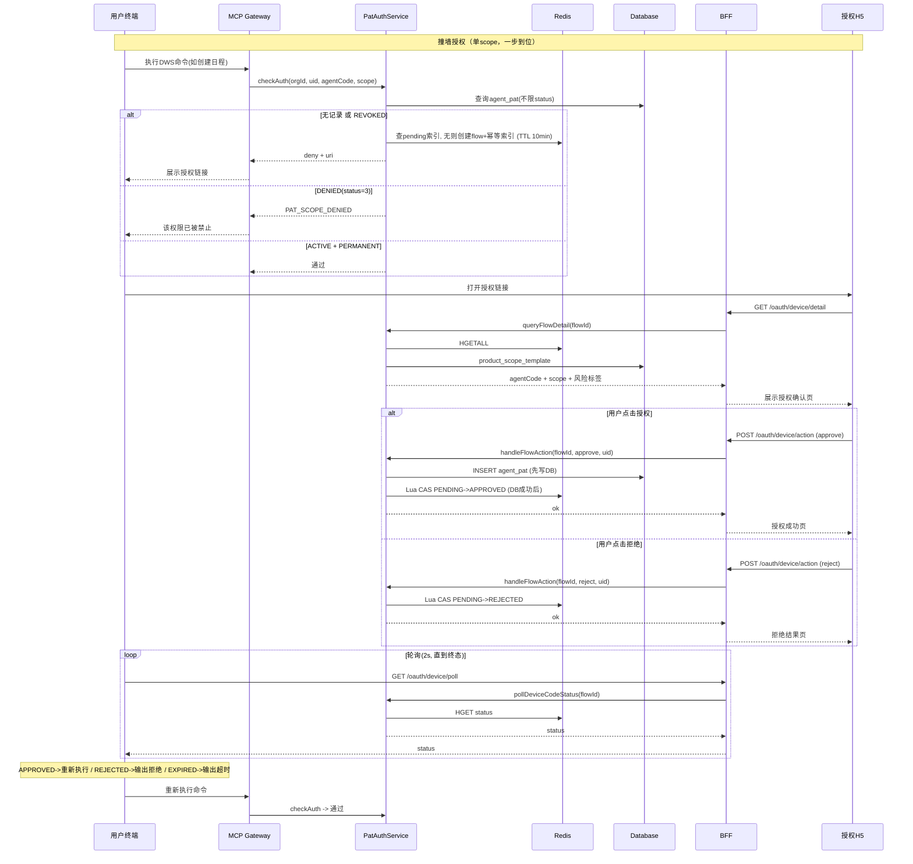

# 技术方案

---

name: 开源版本授权方案 overview: 聚焦 lippi-pat-core 中自身负责的部分：用户撞墙授权链路（单 scope 的 Device Code Flow，状态存 Redis）、grantAuth 写入 agent\_pat、按 clientId 查询权限清单、按 scope 修改授权策略。组织管理员管控层、用户应用列表页、user\_app\_authorization 表均不在本方案范围。本期不做 SESSION 维度授权。 todos:

*   id: device-code-flow content: 实现单 scope Device Code Flow (创建flow/轮询状态)，flow 状态存 Redis，TTL 10min 自动过期 status: completed
    
*   id: auth-h5-api content: 授权 H5 页面后端接口 (查询flow详情含单个scope信息+风险标签, 授权/拒绝合一接口) status: completed
    
*   id: grant-auth-enhance content: approve 时写入单条 agent\_pat 记录 (grant\_scope=PERMANENT) status: completed
    
*   id: query-app-scopes content: 实现按 clientId(agentCode) 查询权限清单接口 (scope列表按品类分组 + 风险等级 + 当前授权策略) status: completed
    
*   id: update-scope-policy content: 实现按 scope 修改单个授权策略(始终允许/禁止) status: completed
    
*   id: check-auth-adapt content: 适配 checkAuth 链路，区分"无记录"与"DENIED"，scope无授权时生成 Device Code Flow status: completed
    
*   id: error-codes content: 扩展 PatErrorCodeEnum 和 PatAuthCheckResult.Data，新增 uri/desc 字段和 Device Code Flow 错误码 status: completed
    
*   id: bff-hsf-consumer content: lippi-open-app-dev HsfConfig 新增 PatAuthService 的 @HSFConsumer status: completed
    
*   id: bff-rpc-service content: lippi-open-app-dev 新增 DWSPatAuthRpcService Controller + routing.json 路由 status: completed isProject: false
    

---

# 开源版本授权方案 -- 技术方案（PAT 侧）

## 一、职责边界

**本方案覆盖（PAT 侧负责）：**

*   用户撞墙授权链路（**单 scope** 的 Device Code Flow 全流程）
    
*   授权 H5 页面后端接口
    
*   grantAuth 授权写入（单条 `agent_pat`）
    
*   按应用 clientId 查询权限清单
    
*   按 scope 修改授权策略（始终允许 / 禁止）
    

**不在本方案范围：**

*   组织管理员管控层（org\_dws\_config / 可用人员白名单 / 渠道管控）
    
*   用户应用列表页（queryAuthorizedApps）
    
*   `user_app_authorization` 表（由其他模块维护）
    
*   SESSION 维度授权（本期不做）
    

## 二、用户撞墙授权链路（单 scope Device Code Flow）

### 2.1 产品交互

用户在 IDE/Agent 中执行 DWS 命令，`checkAuth` 对**当前这一个 scope** 判定无授权时，**一步到位**创建 Device Code Flow 并返回授权链接，终端直接展示（无需用户手动执行额外的 auth 命令）。

**授权 H5 页面：**

*   **授权确认页：** 顶部"个人机器人XX请求你的授权"（应用图标 ⇄ 钉钉图标），展示账号信息，权限信息「授权后，应用将获得以下权限（共1项）>」，显示该 scope 名称 + 风险标签（如"使用钉盘上传下载操作 -- 中风险"），底部「拒绝」/「授权」按钮
    
*   **授权成功页：** 绿色勾 + "授权成功，请返回终端设备继续操作"，底部「个人权限配置」按钮
    
*   **拒绝结果页：** "您已拒绝本次授权请求"，底部「关闭页面」按钮
    

### 2.2 数据模型 -- Redis 存储

Device Code Flow 是短时状态（10 分钟过期），使用 **Redis** 存储，利用 TTL 自动过期，避免轮询打 DB。

**Redis Key 设计：**

| Key | 用途 |
| --- | --- |
| `pat:device_code_flow:{flowId}` | 主 key，存 flow 完整信息 |
| `pat:device_code_flow:user_code:{userCode}` | userCode 反查 flowId |
| `pat:device_code_flow:pending:{orgId}:{uid}:{agentCode}:{scope}` | 幂等索引，同一 (orgId, uid, agentCode, scope) 复用已有 PENDING flow |

`**pat:device_code_flow:{flowId}**` **Value（Hash）：**

| Field | 说明 |
| --- | --- |
| `orgId` | 组织 ID |
| `uid` | 用户 UID |
| `agentCode` | 应用 clientId |
| `scope` | 本次授权的 scope |
| `userCode` | 用户代码（如 JZN2-U4CJ） |
| `status` | PENDING / APPROVED / REJECTED |

**TTL：** 10 分钟。过期即视为超时（终端轮询发现 key 不存在 -> 返回 EXPIRED）。

`**pat:device_code_flow:user_code:{userCode}**` **Value：** flowId 字符串，TTL 同 10 分钟。

### 2.3 接口设计

#### 内部方法：`createDeviceCodeFlow`

`checkAuth` 在 scope 无授权时内部调用，不直接暴露给前端。

**入参：** `orgId`, `uid`, `agentCode`, `scope`

**出参：** `flowId`, `userCode`, `authUrl`

**逻辑（Lua 原子化）：**

整个创建过程通过 **一段 Lua 脚本** 原子执行，避免并发下重复创建：

```lua
-- KEYS[1] = pending索引 key: pat:device_code_flow:pending:{orgId}:{uid}:{agentCode}:{scope}
-- KEYS[2] = 主flow key:    pat:device_code_flow:{newFlowId}
-- KEYS[3] = userCode key:  pat:device_code_flow:user_code:{newUserCode}
-- ARGV[1] = newFlowId, ARGV[2] = newUserCode, ARGV[3..N] = flow hash fields, ARGV[last] = TTL

-- Step 1: 查 pending 索引
local existingFlowId = redis.call('GET', KEYS[1])
if existingFlowId then
    -- Step 2: 校验主 flow key 是否仍然存在（防止脏索引复用已过期的 flow）
    local exists = redis.call('EXISTS', 'pat:device_code_flow:' .. existingFlowId)
    if exists == 1 then
        -- 主 key 存在，复用：返回已有 flowId + userCode
        local uc = redis.call('HGET', 'pat:device_code_flow:' .. existingFlowId, 'userCode')
        return {existingFlowId, uc}
    else
        -- 脏索引：主 key 已过期，清掉索引后 fall through 创建新 flow
        redis.call('DEL', KEYS[1])
    end
end

-- Step 3: 创建新 flow（到达此处说明无有效 pending flow）
redis.call('HSET', KEYS[2], unpack(ARGV, 3, #ARGV - 1))
redis.call('EXPIRE', KEYS[2], ARGV[#ARGV])
redis.call('SET', KEYS[3], ARGV[1], 'EX', ARGV[#ARGV])
redis.call('SET', KEYS[1], ARGV[1], 'EX', ARGV[#ARGV])
return {ARGV[1], ARGV[2]}

```

**Java 调用步骤：**

1.  生成 newFlowId (UUID) + newUserCode (随机 XXXX-XXXX，8位字母数字)
    
2.  执行上述 Lua 脚本，传入 pending 索引 key、新 flow key、新 userCode key 以及 flow 字段和 TTL(600s)
    
3.  Lua 返回 `[flowId, userCode]`（可能是复用的旧值或新创建的值）
    
4.  拼接 authUrl：`{baseUrl}/oauth/device/verify?flow_id={flowId}&user_code={userCode}`
    
5.  返回
    

> 并发安全：Lua 脚本在 Redis 中原子执行，两个并发请求不会各自查空并各自创建。脏索引安全：复用 pending 索引前必须校验主 flow key 存在，过期的脏索引会被清除后重建。

#### 对外接口（BFF HTTP + PAT HSF）

BFF 应用 `lippi-open-app-dev`（域名 `pre-open-dev.dingtalk.com`）暴露 HTTP 接口，内部通过 HSF 调用 PAT core。

**A. Device Code Flow H5 页面（BFF 需登录态，uid 由 BFF 传入 HSF）**

| BFF HTTP 路径 | PAT HSF 方法 | 说明 |
| --- | --- | --- |
| `GET /api/dingtalk-workspace-cli/oauth/device/detail?flowId={flowId}&userCode={userCode}` | queryFlowDetail | H5 页面加载，校验 userCode，返回 agentCode + scope + 风险标签 + status |
| `POST /api/dingtalk-workspace-cli/oauth/device/action` | handleFlowAction | 授权或拒绝，body: `{flowId, userCode, action}`，action=approve/reject |

**B. 权限清单管理（BFF 需登录态）**

| BFF HTTP 路径 | PAT HSF 方法 | 说明 |
| --- | --- | --- |
| `GET /api/dingtalk-workspace-cli/app-auth/scopes?agentCode={agentCode}` | queryAppScopeDetail | scope 列表（按品类分组 + 风险标签 + 授权策略） |
| `POST /api/dingtalk-workspace-cli/app-auth/scope-policy` | updateScopeGrantPolicy | 修改单个 scope 策略，body: `{agentCode, scope, grantPolicy}` |

**C. 终端轮询（BFF 无需登录态）**

| BFF HTTP 路径 | PAT HSF 方法 | 说明 |
| --- | --- | --- |
| `GET /api/dingtalk-workspace-cli/oauth/device/poll?flowId={flowId}` | pollDeviceCodeStatus | 返回 status（PENDING/APPROVED/REJECTED/EXPIRED） |

#### BFF 侧对接（lippi-open-app-dev）

1.  [`**HsfConfig.java**`](lippi-open-app-dev/lippi-open-app-dev-service/src/main/java/com/dingtalk/open/appdev/hsf/consumer/HsfConfig.java) -- 新增 `@HSFConsumer` 声明 `PatAuthService`（已有接口，新增方法后 BFF 侧只需添加 consumer 引用）
    
2.  **新增** `**DWSPatAuthRpcService.java**` -- 在 `lippi-open-app-dev-start/.../http/` 下新增 Controller，继承 `BaseRpcService`，`@RequestMapping("/dingtalk-workspace-cli")`，注入 HSF consumer 并转发调用
    
3.  *   `/api/dingtalk-workspace-cli/oauth/device/detail` -> `/dingtalk-workspace-cli/oauth/device/detail`
        
    *   `/api/dingtalk-workspace-cli/oauth/device/action` -> `/dingtalk-workspace-cli/oauth/device/action`
        
    *   `/api/dingtalk-workspace-cli/oauth/device/poll` -> `/dingtalk-workspace-cli/oauth/device/poll`
        
    *   `/api/dingtalk-workspace-cli/app-auth/scopes` -> `/dingtalk-workspace-cli/app-auth/scopes`
        
    *   `/api/dingtalk-workspace-cli/app-auth/scope-policy` -> `/dingtalk-workspace-cli/app-auth/scope-policy`
        

#### 接口详情

##### `queryFlowDetail`

BFF 路径：`GET /api/dingtalk-workspace-cli/oauth/device/detail?flowId={flowId}&userCode={userCode}`

**HSF 入参：** `flowId`, `userCode`, `uid`（BFF 从登录态获取后传入）

**出参：**

*   `agentCode` -- 应用 clientId（前端通过 agentCode 反查应用系统获取 appName、appIcon）
    
*   `scope`, `displayName`, `riskLevel`
    
*   `status` -- PENDING / APPROVED / REJECTED / EXPIRED
    

**逻辑：**

1.  Redis HGETALL `pat:device_code_flow:{flowId}`
    
2.  不存在 -> 返回 EXPIRED
    
3.  **校验 userCode 与 flow 中存储的 userCode 一致**，不一致返回错误
    
4.  **校验 uid 与 flow 中存储的 uid 一致**，不一致返回错误（防止越权读他人授权详情）
    
5.  查询 `product_scope_template` 获取 displayName、riskLevel
    
6.  返回
    

##### `handleFlowAction`

BFF 路径：`POST /api/dingtalk-workspace-cli/oauth/device/action`

**HSF 入参：** `flowId`, `userCode`, `action`（approve / reject），`uid`（BFF 从登录态获取后传入）

**逻辑：**

1.  Redis HGETALL `pat:device_code_flow:{flowId}`，校验存在、status=PENDING、uid 一致、**userCode 一致**
    
2.  action=approve:
    
    *   **先写 DB**：写入 `agent_pat`（单条 INSERT ON DUPLICATE KEY UPDATE，grant\_scope=PERMANENT）
        
    *   **DB 成功后更新 Redis**：Lua 原子操作 PENDING->APPROVED
        
    *   **删除幂等索引**：DEL `pat:device_code_flow:pending:{orgId}:{uid}:{agentCode}:{scope}`
        
    *   DB 失败则不更新 Redis，保持 PENDING，H5 提示重试
        
3.  action=reject:
    
    *   Redis Lua 原子操作：仅 PENDING->REJECTED
        
    *   **删除幂等索引**：DEL `pat:device_code_flow:pending:{orgId}:{uid}:{agentCode}:{scope}`
        

##### `pollDeviceCodeStatus`

BFF 路径：`GET /api/dingtalk-workspace-cli/oauth/device/poll?flowId={flowId}`

**HSF 入参：** `flowId`

**出参：** `status` (PENDING / APPROVED / REJECTED / EXPIRED)

**逻辑：**

1.  Redis HGET `pat:device_code_flow:{flowId}` status
    
2.  key 不存在 -> EXPIRED
    
3.  返回 status
    

> 轮询全程只读 Redis，不查 DB。

### 2.4 checkAuth 链路适配 -- 新旧分流设计

#### 设计原则：最大限度复用主链路，只在"推送方式"分流

DCF 完全走现有 `checkAuth` 主链路（scope 解析、风险评估、中敏升高敏、PERMANENT 匹配、SESSION/ONCE 处理），差异只在两点：

1.  **DENIED 判定**：主链路查询改 all-status + 加 DENIED 判定（端内未来也需要，直接在主链路加）
    
2.  **被拦截时的推送方式**：端内返回 `buildMediumRiskResult`/`buildHighRiskResult`（推手机），DCF 改为 `createFlowAndBuildResult`（创建 flow + 返回 uri）
    

#### 方案：主链路改造 + source 分流

**1.** `**PatAuthCheckRequest**` **新增** `**source**` **字段：**

```java
public class PatAuthCheckRequest implements Serializable {
    // ... existing fields ...
    private String source;  // null/空=端内（默认），"DEVICE_CODE_FLOW"=开源CLI
}

```

**2.** `**checkAuth()**` **主入口改造（DENIED 判定 + 查询改 all-status）：**

```java
public PatAuthCheckResult checkAuth(PatAuthCheckRequest request) {
    if (!resolveRequestScope(request)) {
        return PatAuthCheckResult.ok();
    }
    String scope = request.getScope();
    if (StringUtils.isBlank(scope)) {
        return PatAuthCheckResult.ok();
    }

    // >>> 改动 1：查询改为 all-status（端内未来也需要 DENIED） <<<
    AgentPatDO pat = agentPatDAO.queryByAgentCodeAndScopeAllStatus(
            request.getOrgId(), request.getUid(), request.getAgentCode(), scope);

    // >>> 改动 2：DENIED 判定（端内和 DCF 统一生效） <<<
    if (pat != null && pat.getStatus() == PatStatusEnum.DENIED.getCode()) {
        return PatAuthCheckResult.fail(
                PatErrorCodeEnum.PAT_SCOPE_DENIED.getCode(),
                PatErrorCodeEnum.PAT_SCOPE_DENIED.getMessage());
    }

    // >>> 改动 3：非 ACTIVE 视为无记录（REVOKED/PENDING_APPROVAL 等同于 null） <<<
    if (pat != null && pat.getStatus() != PatStatusEnum.ACTIVE.getCode()) {
        pat = null;
    }

    // === 以下为现有逻辑，完全不动 ===
    if (pat == null) {
        return evaluateRiskAndBuildResult(request, scope);
    }
    return classifyAndHandle(request, scope, pat);
}

```

**3.** `**evaluateRiskAndBuildResult()**` **内部加 source 分流（仅在构建结果时）：**

```java
private PatAuthCheckResult evaluateRiskAndBuildResult(PatAuthCheckRequest request, String scope) {
    // ... 现有风险评估逻辑完全不动 ...
    // LOW → ok
    // MEDIUM → shouldUpgradeToHigh? → HIGH

    if (riskLevel == RiskLevelEnum.MEDIUM) {
        // >>> source 分流 <<<
        if ("DEVICE_CODE_FLOW".equals(request.getSource())) {
            return createFlowAndBuildResult(request, scope);
        }
        return buildMediumRiskResult(template);  // 现有行为不变
    }

    // HIGH
    if (tryConsumeApprovedHighRiskRecord(request, scope)) {
        return PatAuthCheckResult.ok();  // DCF 无 sessionId，此处自然返回 false，继续往下走
    }

    // >>> source 分流 <<<
    if ("DEVICE_CODE_FLOW".equals(request.getSource())) {
        return createFlowAndBuildResult(request, scope);
    }
    return buildHighRiskResult(request, scope, template);  // 现有行为不变
}

```

**4.** `**tryConsumeHighRiskApproval()**` **内部加 source 分流（PERMANENT + 高敏升级场景）：**

```java
private PatAuthCheckResult tryConsumeHighRiskApproval(PatAuthCheckRequest request,
                                                      String scope, AgentPatDO pat) {
    // ... 现有升级判定逻辑完全不动 ...
    // isScopeUpgradable + shouldUpgradeToHigh

    if (tryConsumeApprovedHighRiskRecord(request, scope)) {
        return PatAuthCheckResult.ok();  // DCF 无 sessionId，自然返回 false
    }

    // >>> source 分流 <<<
    if ("DEVICE_CODE_FLOW".equals(request.getSource())) {
        return createFlowAndBuildResult(request, scope);
    }
    return evaluateAsHighRisk(request, scope);  // 现有行为不变
}

```

**5. MCP Gateway 设置** `**source**`**：**

MCP Gateway 调用 `PatAuthService.checkAuth()` 时设置 `request.setSource("DEVICE_CODE_FLOW")`。现有端内调用方不设置 source（为 null），所有 `if ("DEVICE_CODE_FLOW".equals(...))` 分支不进入。

#### 改动最小化对照

| 改动点 | 影响范围 | 说明 |
| --- | --- | --- |
| 查询改 all-status | 主链路 | `queryByAgentCodeAndScope` → `queryByAgentCodeAndScopeAllStatus`，非 ACTIVE 视为 null |
| DENIED 判定 | 主链路 | 端内和 DCF 统一生效，端内当前无 status=3 记录不受影响 |
| `evaluateRiskAndBuildResult` 加 2 个 `if` | MEDIUM/HIGH 结果构建 | DCF 走 `createFlowAndBuildResult`，端内不变 |
| `tryConsumeHighRiskApproval` 加 1 个 `if` | PERMANENT + 升级结果构建 | DCF 走 `createFlowAndBuildResult`，端内不变 |
| 新增 `source` 字段 | `PatAuthCheckRequest` | 端内不设置，默认 null |

> **关键：scope 解析、风险评估、中敏升高敏判定、PERMANENT/SESSION/ONCE 分类处理、**`**tryConsumeApprovedHighRiskRecord**` **等全部复用，一行不改。** DCF 无 sessionId 时 `tryConsumeApprovedHighRiskRecord` 自然返回 false（已有的空值保护），无需额外处理。

`**PatAuthCheckResult**` **响应结构（字段放在 Data 内部类中）：**

撞墙（scope 无授权）：  $\color{#0089FF}{@上官玄(玄玦)}$ 

无Agent实例

```json
{
        "code": "AGENT_CODE_NOT_EXISTS",
        "data": {
            "clientId": "123",
           "clientSecret": "456",
        },
        "flowId":"xxx",
        "url": "https://open-dev.dingtalk.com/oauth/device/verify?flow_id=xxx&user_code=JZN2-U4CJ",
        "success": false,
        "message": "agentCode not exists, CLI app created",
、    }
```

首次使用CLI，撞墙，刷新clienId和clientSecret到环境变量，并登出登录(告知用户)，并轮训flowId的状态。

无对应权限点

```json
{
    "success": false,
    "code": "PAT_MEDIUM_RISK_NO_PERMISSION",
    "data": {
        "requiredScopes": [
            {
                "productCode": "aitable",
                "productName": "AI表格",
                "scope": "aitable.record.read",
                "displayName": "AI表格-行数据-读取"
            }
        ],
        "grantOptions": ["permanent"],
        "flowId":"xxx",
        "url": "https://open-dev.dingtalk.com/oauth/device/verify?flow_id=xxx&user_code=JZN2-U4CJ",
        "desc": "在浏览器中打开以下链接进行认证"
    }
}

```

撞墙，并轮训flowId的状态。

用户明确禁止的 scope

```json
{
    "success": false,
    "code": "PAT_SCOPE_DENIED",
    "message": "This scope has been explicitly denied by the user."
}

```

直接告诉用户你已禁止访问本权限点访问。

**轮询响应示例：**

授权成功：

```json
{
    "success": true,
    "data": { "status": "APPROVED" }
}

```

用户拒绝：

```json
{
    "success": false,
    "code": "DEVICE_CODE_REJECTED",
    "data": { "status": "REJECTED" },
    "message": "The end user denied the authorization request."
}

```

授权超时（Redis key 过期）：

```json
{
    "success": false,
    "code": "DEVICE_CODE_EXPIRED",
    "data": { "status": "EXPIRED" },
    "message": "Authorization timed out, please try again."
}

```

`**PatAuthCheckResult.Data**` **新增字段：**

```java
@Getter @Setter
public static class Data implements Serializable {
    private List<RequiredScopeInfo> requiredScopes;
    private List<String> grantOptions;
    private String authRequestId;
    // Device Code Flow 新增
    private String uri;          // 授权链接（含 flow_id 参数，终端直接展示+轮询解析）
    private String desc;         // 授权提示文案
}

```

## 三、grantAuth 授权写入

`handleFlowAction(action=approve)` 确认授权时，写入单条 `agent_pat` 记录：

*   **INSERT ON DUPLICATE KEY UPDATE**
    
*   `grant_scope` 统一为 **PERMANENT(3)**（本期不做 SESSION 维度授权）
    

> `user_app_authorization` 的维护不在本方案范围，由调用方或其他模块负责。

## 四、按 clientId 查询权限清单

### 4.1 产品交互

用户点击某应用"编辑"后弹出「数据权限范围管理」弹窗，scope 按品类分组，每条显示名称 + 风险标签 + 授权策略下拉框（始终允许 / 禁止）。

### 4.2 接口：`queryAppScopeDetail(orgId, uid, agentCode)`

**复用** `**DWSPatAuthIServiceImpl.queryAuthList()**` **的核心逻辑。**

#### 重构方式 -- 共享数据准备，DTO 映射隔离

现有 `queryAuthList()` Lines 197-256 分两层：

*   **数据准备层**（Lines 197-212）：template 查询 + auth map 构建 + productCode 分组 -- **可共享**
    
*   **DTO 映射层**（Lines 220-252）：填充 `AuthItem` 字段 -- **各自独立**，因为 LWP 的 `AuthItem` 和新 HSF 的 `ScopeGroupDTO` 字段不同
    

**公共方法返回中间数据结构，不返回任何 DTO：**

```java
// PatAuthManager 新增 — 返回中间数据，不绑定任何出参 DTO
public ScopeAuthContext buildScopeAuthContext(List<AgentPatDO> records) {
    List<ProductScopeTemplateDO> allTemplates = checkService.queryAllTemplates();
    Map<String, AgentPatDO> authMap = buildScopeBestAuthMap(records);
    Map<String, List<ProductScopeTemplateDO>> groupedTemplates = allTemplates.stream()
            .collect(Collectors.groupingBy(
                    tmpl -> tmpl.getProductCode() != null ? tmpl.getProductCode() : "unknown",
                    LinkedHashMap::new, Collectors.toList()));
    return new ScopeAuthContext(groupedTemplates, authMap);
}

// 中间数据结构（内部使用，不暴露给调用方）
@Getter @AllArgsConstructor
public class ScopeAuthContext {
    private Map<String, List<ProductScopeTemplateDO>> groupedTemplates;
    private Map<String, AgentPatDO> authMap;
}

```

**两个调用方各自做 DTO 映射：**

```java
// LWP queryAuthList — DTO 映射不变，只是数据准备改为调用公共方法
List<AgentPatDO> records = agentPatDAO.queryByOrgIdAndUid(
        orgId, uid, agentCode, productCode, grantScope);  // 仅 status=1
ScopeAuthContext ctx = patAuthManager.buildScopeAuthContext(records);
// 遍历 ctx.groupedTemplates，填充 AuthItem（grantScope/grantScopeDesc/accessGrantScope）
// 逻辑与现有 Lines 220-252 完全一致

// HSF queryAppScopeDetail — 独立 DTO 映射，含 DENIED 分支
List<AgentPatDO> records = agentPatDAO.queryByOrgIdAndUidAllStatus(
        orgId, uid, agentCode);  // status=1 和 status=3
ScopeAuthContext ctx = patAuthManager.buildScopeAuthContext(records);
// 遍历 ctx.groupedTemplates，填充 ScopeGroupDTO（grantPolicy: ALWAYS_ALLOW/DENIED/默认值）
// 新增 DENIED 分支：pat.status=3 -> grantPolicy=DENIED

```

#### DTO 隔离保证

| 维度 | 现有 `queryAuthList`（LWP） | 新 `queryAppScopeDetail`（HSF） |
| --- | --- | --- |
| 调用入口 | LWP H5 → DWSPatAuthIServiceImpl | BFF HTTP → PatAuthService HSF |
| DAO 查询 | `queryByOrgIdAndUid`（仅 status=1） | `queryByOrgIdAndUidAllStatus`（status=1 和 3） |
| 公共方法 | `patAuthManager.buildScopeAuthContext(records)` | 同左 |
| 返回 DTO | `PatAuthListResponse.AuthGroup` / `AuthItem`（grantScope/grantScopeDesc） | `ScopeGroupDTO`（grantPolicy: ALWAYS\_ALLOW/DENIED） |
| DENIED 映射 | 不涉及（查不到 status=3，映射逻辑也不含 DENIED 分支） | 有（pat.status=3 -> DENIED） |
| 无记录默认 | 按风险等级给默认值 LOW->PERMANENT, MEDIUM/HIGH->"待确认" | 按风险等级给默认值（同左逻辑，但映射到 grantPolicy 字段） |

> 公共方法只返回 `ScopeAuthContext`（template 分组 + auth map），**不包含任何 DTO 字段映射**。LWP 和 HSF 各自遍历 context 填充自己的 DTO，互不干扰。

**出参：**

```json
{
  "groups": [
    {
      "productCode": "chat",
      "productName": "会话与群聊",
      "totalCount": 13,
      "scopes": [
        {
          "scope": "chat.conversation:search",
          "displayName": "搜索会话列表",
          "riskLevel": "LOW",
          "grantPolicy": "ALWAYS_ALLOW"
        },
        {
          "scope": "chat.message:read",
          "displayName": "拉取会话消息内容",
          "riskLevel": "MEDIUM",
          "grantPolicy": "DENIED"
        }
      ]
    }
  ]
}

```

**逻辑：**

1.  `product_scope_template.queryAllEnabled()` 获取全量 scope 元数据
    
2.  `agent_pat.queryByOrgIdAndUidAllStatus(orgId, uid, agentCode)` 获取该应用已有授权记录（包含 status=1 和 status=3）
    
3.  按 
    
    *   有记录 + status=3(DENIED) -> `DENIED`（新增分支）
        
    *   有记录 + status=1(ACTIVE) -> 按 grant\_scope 映射（复用端内逻辑）
        
    *   无记录 -> 按风险等级给默认值（复用端内逻辑：LOW->PERMANENT/"始终允许", MEDIUM->"待确认", HIGH->"待确认"）
        

## 五、按 scope 修改授权策略

#### `updateScopeGrantPolicy(orgId, uid, agentCode, scope, grantPolicy)`

**逻辑：**

已有记录时 UPDATE，无记录时 INSERT（需从 `product_scope_template` 补齐字段）。

*   *   有记录 -> UPDATE: grant\_scope=PERMANENT(3), status=1(ACTIVE)
        
    *   无记录 -> INSERT: productCode 从 template 获取, patToken=UUID, grant\_scope=PERMANENT(3), status=1(ACTIVE)
        
*   *   有记录 -> UPDATE: status=3(DENIED)，grant\_scope 保持不变
        
    *   无记录 -> INSERT: productCode 从 template 获取, patToken=UUID, grant\_scope=PERMANENT(3), status=3(DENIED)
        

**INSERT 时必填字段：**

```java
AgentPatDO pat = new AgentPatDO();
pat.setOrgId(orgId);
pat.setUid(uid);
pat.setAgentCode(agentCode);
pat.setScope(scope);
pat.setProductCode(template.getProductCode());  // 从 product_scope_template 获取
pat.setPatToken(UUID.randomUUID().toString().replace("-", ""));
pat.setGrantScope(GrantScopeEnum.PERMANENT.getCode());  // 固定 PERMANENT(3)
pat.setStatus(statusByPolicy);  // ALWAYS_ALLOW->1, DENIED->3

```

### agent\_pat status 值定义

| status | 枚举 | 含义 |
| --- | --- | --- |
| 0 | REVOKED | 已撤销（过期、系统撤销等） |
| 1 | ACTIVE | 有效授权 |
| 2 | PENDING\_APPROVAL | 待审批（已有，端内高敏审批用） |
| 3 | DENIED | 用户明确禁止（**新增**） |

> status=3(DENIED) 是本期新增的状态值。不能使用 status=2，因为 PENDING\_APPROVAL 已被 `PatAuthApprovalService` 的高敏审批链路使用。checkAuth 查到 DENIED 时直接返回 `PAT_SCOPE_DENIED`，不触发 Device Code Flow。

## 六、完整时序图



## 七、代码改动清单

### 新增类

| 类名 | 包路径 | 职责 |
| --- | --- | --- |
| `DeviceCodeFlowService` | `c.d.pat.manager` | 单 scope Device Code Flow（创建/查询/批准/拒绝/轮询），操作 Redis |
| `ScopeAuthContext` | `c.d.pat.manager` | 公共中间数据结构（template 分组 + auth map），供 LWP 和 HSF 各自做 DTO 映射 |
| `GrantPolicyEnum` | `c.d.pat.enums` | ALWAYS\_ALLOW / DENIED |
| `ScopeGroupDTO` | `c.d.pat.model` | 新 HSF 专用：按品类分组的 scope 返回结构（含 grantPolicy 字段） |
| `DeviceCodeFlowDTO` | `c.d.pat.model` | Device Code Flow 详情返回结构 |

### 改动类

| 文件 | 改动内容 |
| --- | --- |
| [`PatAuthCheckRequest.java`](lippi-pat-core/lippi-pat-core-api/src/main/java/com/dingtalk/pat/model/request/PatAuthCheckRequest.java) | 新增 `source` 字段（String），用于分流路由。值为 `"DEVICE_CODE_FLOW"` 时走开源版逻辑，null/空走现有逻辑 |
| [`PatAuthCheckService.java`](lippi-pat-core/lippi-pat-core-service/src/main/java/com/dingtalk/pat/manager/PatAuthCheckService.java) | `checkAuth()` 查询改 all-status + 加 DENIED 判定（主链路改动，端内也生效）；`evaluateRiskAndBuildResult` 和 `tryConsumeHighRiskApproval` 内部各加一个 `if(source==DCF)` 分流到 `createFlowAndBuildResult`；其余逻辑不动 |
| [`PatAuthCheckResult.java`](lippi-pat-core/lippi-pat-core-api/src/main/java/com/dingtalk/pat/model/response/PatAuthCheckResult.java) | Data 内部类新增 `uri`, `desc` 字段 |
| [`PatAuthService.java`](lippi-pat-core/lippi-pat-core-api/src/main/java/com/dingtalk/pat/hsf/PatAuthService.java) | 接口新增 queryFlowDetail / handleFlowAction / pollDeviceCodeStatus / queryAppScopeDetail / updateScopeGrantPolicy |
| [`PatAuthServiceImpl.java`](lippi-pat-core/lippi-pat-core-service/src/main/java/com/dingtalk/pat/hsf/provider/PatAuthServiceImpl.java) | 实现新增的 5 个 HSF 方法 |
| [`PatAuthManager.java`](lippi-pat-core/lippi-pat-core-service/src/main/java/com/dingtalk/pat/manager/PatAuthManager.java) | 转发 DeviceCodeFlowService 接口；新增 `buildScopeAuthContext(records)` 公共方法（返回 `ScopeAuthContext`：template 分组 + auth map，**不含 DTO 映射**）。**不抽取涉及 SESSION/ONCE/审批的逻辑** |
| [`DWSPatAuthIServiceImpl.java`](lippi-pat-core/lippi-pat-core-service/src/main/java/com/dingtalk/pat/lwp/DWSPatAuthIServiceImpl.java) | queryAuthList 数据准备层改为调用 `PatAuthManager.buildScopeAuthContext()`，**DTO 映射逻辑（AuthItem 填充）保持原位不动**。DAO 查询不变（仍用 `queryByOrgIdAndUid` 仅 status=1），出参结构不变 |
| [`PatErrorCodeEnum.java`](lippi-pat-core/lippi-pat-core-api/src/main/java/com/dingtalk/pat/enums/PatErrorCodeEnum.java) | 新增 `PAT_SCOPE_DENIED`, `DEVICE_CODE_REJECTED`, `DEVICE_CODE_EXPIRED` |
| [`PatStatusEnum.java`](lippi-pat-core/lippi-pat-core-api/src/main/java/com/dingtalk/pat/enums/PatStatusEnum.java) | 新增 `DENIED(3)` 状态 |
| [`agent-pat.xml`](lippi-pat-core/lippi-pat-core-service/src/main/resources/mybatis/pat/agent-pat.xml) | 新增两个 all-status 查询：`queryByAgentCodeAndScopeAllStatus`（checkAuth Device Code Flow 分支用）、`queryByOrgIdAndUidAllStatus`（queryAppScopeDetail 用） |

### 改动影响一览

```plaintext
PatAuthCheckService.checkAuth()
    │
    ├─ resolveRequestScope()                    [不动]
    ├─ queryByAgentCodeAndScopeAllStatus()       [改动: status=1 → all-status]
    ├─ DENIED(3) → PAT_SCOPE_DENIED             [新增: 端内+DCF统一]
    ├─ 非ACTIVE → 视为null                       [新增: REVOKED等同于无记录]
    │
    ├─ pat==null → evaluateRiskAndBuildResult()
    │    ├─ LOW → ok                             [不动]
    │    ├─ MEDIUM + shouldUpgradeToHigh → HIGH  [不动]
    │    ├─ MEDIUM blocked:
    │    │    ├─ source=DCF → createFlowAndBuildResult  [新增分流]
    │    │    └─ 端内 → buildMediumRiskResult            [不动]
    │    └─ HIGH blocked:
    │         ├─ tryConsumeApproved (DCF无sessionId→false) [不动]
    │         ├─ source=DCF → createFlowAndBuildResult  [新增分流]
    │         └─ 端内 → buildHighRiskResult(推手机)       [不动]
    │
    └─ pat!=null → classifyAndHandle()
         ├─ PERMANENT → handleMatchedScope
         │    └─ tryConsumeHighRiskApproval
         │         ├─ 无需升级 → ok                      [不动]
         │         ├─ 需升级 + tryConsumeApproved        [不动]
         │         ├─ source=DCF → createFlowAndBuildResult [新增分流]
         │         └─ 端内 → evaluateAsHighRisk(推手机)    [不动]
         ├─ SESSION → 匹配sessionId                      [不动, DCF不会命中]
         └─ ONCE → CAS消费                               [不动, DCF不会命中]

```

## 八、HTTP 接口协议（给前端和终端）

域名：`pre-open-dev.dingtalk.com`，BFF 应用 `lippi-open-app-dev`

### A. 前端接口（需登录态）

#### 1. 查询 flow 详情

```plaintext
GET /dingtalk-workspace-cli/oauth/device/detail?flowId={flowId}&userCode={userCode}

```

成功响应：

```json
{
    "success": true,
    "data": {
        "agentCode": "app_xxxx",
        "appName": "个人机器人XX",
        "appIcon": "https://cdn.dingtalk.com/xxx/app\_icon.png",
        "userName": "小钉",
        "userAvatar": "@lADPxxxxxx",
        "status": "PENDING",
        "scopes": [
            {
                "scope": "aitable.record.read",
                "displayName": "使用钉盘上传下载操作",
                "productCode": "dingpan",
                "productName": "钉盘",
                "riskLevel": 1,
                "riskDesc": "中风险"
            }
        ]
    }
}

```

字段说明：

*   `agentCode`：应用唯一标识
    
*   `appName`：应用名称，BFF 层根据 agentCode 反查应用系统后填充，用于页面顶部 "个人机器人XX请求你的授权"
    
*   `appIcon`：应用图标 URL，BFF 层填充，用于页面顶部应用图标展示
    
*   `userName`：当前登录用户昵称，BFF 层从 `UserProfileClient` 获取，用于 "你将使用以下账号授权登录" 区域
    
*   `userAvatar`：当前登录用户头像（avatarMediaId），BFF 层填充，用于用户头像展示
    
*   `status`：`PENDING` / `APPROVED` / `REJECTED` / `EXPIRED`
    
*   `scopes`：权限条目列表（当前单 scope），前端用 `scopes.length` 显示"共N项"
    
*   `scopes[ ].displayName`：权限名称，直接渲染为权限条目文案
    
*   `scopes[ ].riskDesc`：风险等级标签文案（"低风险" / "中风险" / "高风险"），直接渲染为标签
    

错误响应：

```json
{ "success": false, "code": "INVALID_USER_CODE", "message": "userCode mismatch" }

```

#### 2. 授权 / 拒绝

```plaintext
POST /dingtalk-workspace-cli/oauth/device/action
Content-Type: application/json

{ "flowId": "OIDIRv8KHm...", "userCode": "JZN2-U4CJ", "action": "approve" }

```

action 取值：`approve` / `reject`

成功响应：

```json
{ "success": true }

```

错误响应：

```json
{ "success": false, "code": "FLOW_ALREADY_PROCESSED", "message": "flow is not in PENDING status" }

```

#### 3. 查询权限清单

```plaintext
GET /dingtalk-workspace-cli/app-auth/scopes?agentCode={agentCode}

```

响应：

```json
{
    "success": true,
    "data": {
        "groups": [
            {
                "productCode": "chat",
                "productName": "会话与群聊",
                "scopes": [
                    {
                        "scope": "chat.conversation:search",
                        "displayName": "搜索会话列表",
                        "riskLevel": 1,
                        "grantPolicy": "ALWAYS_ALLOW"
                    },
                    {
                        "scope": "chat.message:read",
                        "displayName": "拉取会话消息内容",
                        "riskLevel": 2,
                        "grantPolicy": "DENIED"
                    }
                ]
            }
        ]
    }
}

```

grantPolicy 取值：`ALWAYS_ALLOW`（始终允许）/ `DENIED`（禁止）/ 无此字段时按风险等级默认（LOW->始终允许, MEDIUM/HIGH->待确认）

#### 4. 修改单个 scope 策略

```plaintext
POST /dingtalk-workspace-cli/app-auth/scope-policy
Content-Type: application/json

{ "agentCode": "app_xxxx", "scope": "chat.message:read", "grantPolicy": "DENIED" }

```

grantPolicy 取值：`ALWAYS_ALLOW` / `DENIED`

响应：

```json
{ "success": true }

```

### B. 终端接口（无需登录态）  $\color{#0089FF}{@上官玄(玄玦)}$ 

#### 5. 轮询 flow 状态

```plaintext
GET /dingtalk-workspace-cli/oauth/device/poll?flowId={flowId}

```

等待中：

```json
{ "success": true, "data": { "status": "PENDING" } }

```

授权成功：

```json
{ "success": true, "data": { "status": "APPROVED" } }

```

用户拒绝：

```json
{ "success": false, "code": "DEVICE_CODE_REJECTED", "data": { "status": "REJECTED" }, "message": "The end user denied the authorization request." }

```

超时过期：

```json
{ "success": false, "code": "DEVICE_CODE_EXPIRED", "data": { "status": "EXPIRED" }, "message": "Authorization timed out, please try again." }

```

### C. checkAuth HSF 响应扩展（MCP Gateway 调用）

撞墙时返回 `uri`，终端从中解析 `flow_id` 参数用于轮询：

```json
{
    "success": false,
    "code": "PAT_MEDIUM_RISK_NO_PERMISSION",
    "data": {
        "requiredScopes": [{ "productCode": "aitable", "productName": "AI表格", "scope": "aitable.record.read", "displayName": "AI表格-行数据-读取" }],
        "grantOptions": ["permanent"],
        "uri": "https://open-dev.dingtalk.com/oauth/device/verify?flow\_id=xxx&user\_code=JZN2-U4CJ",
        "desc": "在浏览器中打开以下链接进行认证"
    }
}

```

用户明确禁止的 scope：

```json
{ "success": false, "code": "PAT_SCOPE_DENIED", "message": "This scope has been explicitly denied by the user." }

```

## 九、风险与注意事项

*   **agentCode 天然隔离：** 端内应用和开源 CLI 应用使用不同的 agentCode，`agent_pat` 的 UK 是 `(org_id, uid, agent_code, scope)`，因此 DCF 写入（approve/DENIED）不会覆盖端内已有的 SESSION/ONCE/ACTIVE 记录，两套数据互不影响
    
*   **主链路复用 + 最小分流：** DCF 完全走现有 `checkAuth` 主链路（scope 解析、风险评估、中敏升高敏、PERMANENT/SESSION/ONCE 处理），只在 `evaluateRiskAndBuildResult` 和 `tryConsumeHighRiskApproval` 内部各加一个 `if(source==DCF)` 分流到 `createFlowAndBuildResult`。DENIED 判定和 all-status 查询直接改在主链路（端内未来也需要）。DCF 无 sessionId 时 `tryConsumeApprovedHighRiskRecord` 自然返回 false，无需额外处理
    
*   **queryAuthList 行为不变：** 公共方法 `buildScopeAuthContext(records)` 只返回中间数据（template 分组 + auth map），**不返回任何 DTO**。LWP 的 `AuthItem` 填充逻辑保持原位，新 HSF 用独立的 `ScopeGroupDTO` 做映射，两者 DTO 完全隔离。LWP DAO 查询不变（`queryByOrgIdAndUid` 仅 status=1），出参结构不变
    
*   **DENIED 稳定拒绝：** agent\_pat 新增 status=3(DENIED)，`checkAuthForDeviceCodeFlow` 查到 DENIED 直接返回 `PAT_SCOPE_DENIED`，不触发 Device Code Flow。现有 `checkAuth` 查的是 status=1，不会查到 status=3 的记录，不影响端内行为
    
*   **本期不做 SESSION：** 开源版 grant\_scope 统一为 PERMANENT，这只发生在 Device Code Flow 分支和 `updateScopeGrantPolicy` 新入口，不影响端内 grantAuth 的 SESSION/ONCE 写入
    
*   **先 DB 后 Redis：** approve 时先写 agent\_pat 到 DB，DB 成功后再更新 Redis 状态为 APPROVED，避免"终端看到 APPROVED 但 DB 未落库"的一致性问题
    
*   **字段位置兼容：** Device Code Flow 新增字段（uri/desc）放在 `PatAuthCheckResult.Data` 内部类中，与现有 `data.requiredScopes`/`data.grantOptions` 结构一致，不破坏外层模型。终端从 `uri` 的 `flow_id` 参数解析 flowId 用于轮询，不再单独返回 flowId 字段
    
*   **单 scope 粒度：** 每次撞墙只针对当前 scope 创建 flow，用户使用不同 scope 的命令会触发多次独立授权
    
*   **统一网页授权：** 开源版本（`source=DEVICE_CODE_FLOW` 分支下）中/高风险 scope 均通过 Device Code Flow 网页授权，不影响端内的高敏手机审批链路
    
*   **Redis 存储：** flow 状态存 Redis，TTL 10min 自动过期，无需定时清理任务；轮询全程只读 Redis 不查 DB
    
*   **幂等原子性：** createDeviceCodeFlow 使用 Lua 脚本原子执行（查 pending 索引 + 校验主 key 存在 + 创建 flow），approve/reject 使用 Lua CAS（仅 PENDING 可转换）
    
*   **Redis 不可用降级：** Redis 故障时 createDeviceCodeFlow 失败，checkAuth 降级返回传统 deny + grantOptions（不影响端内场景）
    
*   **轮询策略：** 终端 2 秒间隔轮询，最多 10 分钟（与 TTL 对齐）